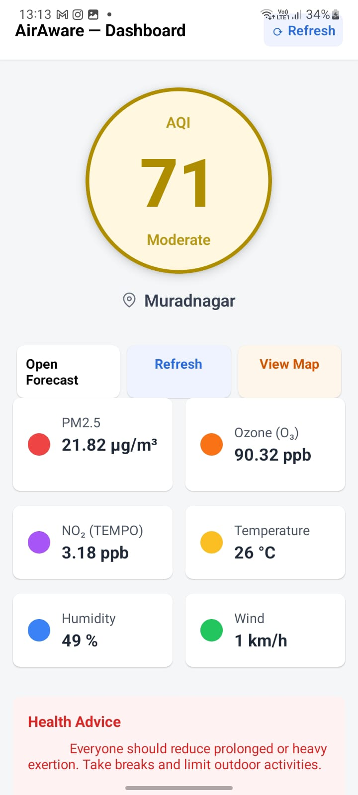
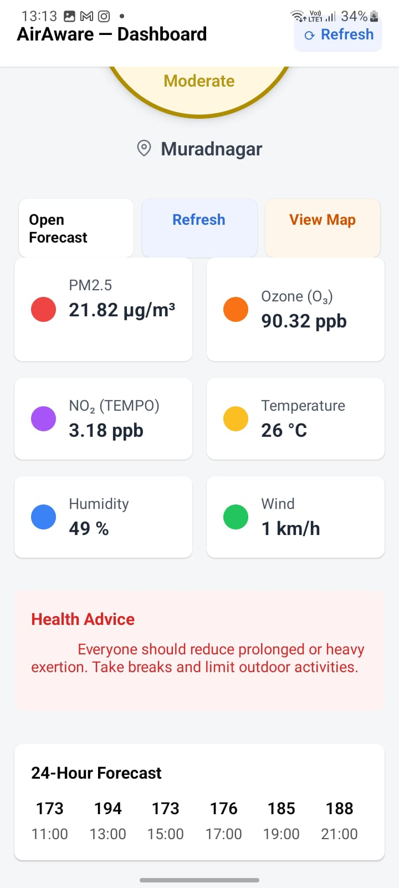

<h1 align="center">🌍⚡ Unified Air Pollution Data API</h1>

<p align="center">


</p>

<p align="center">
<strong>Next-gen Air Quality Monitoring</strong> — powered by a real-time fusion of <strong>NASA TEMPO Satellite Data</strong>, the <strong>OpenAQ Community Network</strong>, and the <strong>OpenWeather API</strong>.
</p>

---


## 📌 Overview  
Air quality data is often siloed across different platforms, making it difficult to get a complete, accurate picture.  
This **Unified API** acts as a middleware layer that combines **satellite-based**, **ground-based**, and **forecast-based** pollution data into one **simple, unified endpoint**.  

It is designed for **developers, researchers, and environmental organizations** to access **comprehensive AQI insights** for any location on Earth in real time.  

---


How to Run:)

# Clone Repo
git clone https://github.com/your-username/air-quality-app.git
cd air-quality-app

# Install Backend Dependencies
cd server
npm install

# Start Backend Server
npm start
# Backend will run on http://localhost:4000

# Run Android App (Expo / React Native)
cd ../android-app
npm install
npx expo start
# Scan the QR code with your Android device to launch the app


## 🔬 Core Data Sources  

| Source          | Type           | Key Data Provided                           | Strength                                                                 |
|-----------------|---------------|---------------------------------------------|--------------------------------------------------------------------------|
| 🛰 **NASA TEMPO**   | Satellite      | Ozone (O₃), Nitrogen Dioxide (NO₂)           | High-resolution regional coverage; hourly data at a neighborhood scale across North America. |
| 🌐 **OpenAQ**      | Ground Stations | PM2.5, PM10, Carbon Monoxide (CO)            | "Ground truth" accuracy from government + community sensors. Essential for particulate matter. |
| ☁ **OpenWeather** | Forecast Model | AQI (1–5), PM2.5, O₃, Weather Data           | Global coverage with real-time, historical, and forecasted AQ + weather data. |

---

## 🚀 Key Features  
- ✅ **Multi-Source Data Fusion**: Combines satellite, ground, and forecast data.  
- ✅ **Real-Time AQI Anywhere**: Works with any latitude & longitude.  
- ✅ **Rich Pollutant Data**: PM2.5, PM10, O₃, NO₂, CO, SO₂ concentrations.  
- ✅ **Unified JSON Response**: Abstracts multiple APIs into a single format.  
- ✅ **Location-Aware**: Fetches nearest & most relevant sources automatically.  
- ✅ **Lightweight & Scalable**: Node.js/Express-based, easy to deploy.  
- ✅ **Free-Tier Friendly**: Designed to stay within free API limits.  

---

## 🛠️ How It Works  

1. Client sends request with latitude & longitude → `/api/aq`.  
2. Server makes **parallel async calls** to NASA TEMPO, OpenAQ, and OpenWeather.  
3. Responses are **processed, standardized, and merged**.  
4. Returns a **unified JSON object** containing satellite + ground + forecast data.  

---

## ⚡ API Usage Example  

**Example Request (Delhi, India) + Unified Response:**  

```bash
curl "http://your-server-address:4000/api/aq?lat=28.7041&lon=77.1025"

{
  "request_info": {
    "latitude": 28.7041,
    "longitude": 77.1025,
    "timestamp_utc": "2025-10-01T07:51:00.123Z",
    "location_name": "Delhi, IN"
  },
  "unified_aqi": {
    "value": 185,
    "category": "Unhealthy",
    "dominant_pollutant": "PM2.5",
    "health_advisory": "Everyone may begin to experience health effects; members of sensitive groups may experience more serious health effects."
  },
  "data_sources": {
    "satellite_tempo": {
      "status": "success",
      "timestamp": "2025-10-01T07:30:00Z",
      "data": {
        "ozone_column": { "value": 310.2, "units": "DU" },
        "no2_column": { "value": 22.5, "units": "mol/m^2" }
      }
    },
    "ground_station_openaq": {
      "status": "success",
      "station_name": "Anand Vihar, Delhi - CPCB",
      "timestamp": "2025-10-01T07:45:15Z",
      "data": {
        "pm25": { "value": 121, "units": "µg/m³" },
        "pm10": { "value": 245, "units": "µg/m³" },
        "no2": { "value": 32, "units": "µg/m³" }
      }
    },
    "forecast_openweather": {
      "status": "success",
      "timestamp": "2025-10-01T07:00:00Z",
      "data": {
        "aqi_index": 5,
        "pm2_5": { "value": 115.3, "units": "µg/m³" },
        "co": { "value": 2100.9, "units": "µg/m³" },
        "o3": { "value": 68.6, "units": "µg/m³" }
      }
    }
  },
  "weather": {
    "temp_celsius": 29.5,
    "humidity_percent": 65,
    "wind_kph": 10.2,
    "condition": "Haze"
  }
}


Tech Stack

Backend: Node.js, Express.js

HTTP Client: Axios

Data Sources:

🛰 NASA TEMPO API (satellite)

🌐 OpenAQ API (ground-based)

☁ OpenWeather API (forecast + history)
